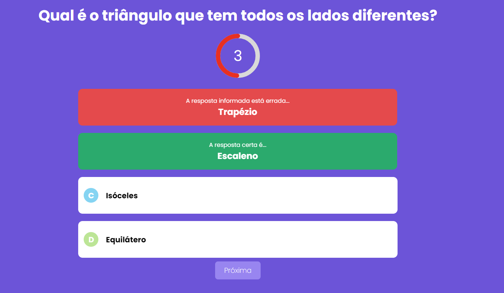

# Quiz


<p align="center">
    
</p>


> Projeto realizado para colocar em prática os meus conhecimentos em Next.js, criando um sistema de perguntas e respostas.

## 📍 Deploy

Link do projeto: https://quiz-xi-gules.vercel.app/

## 💻 Pré-requisitos

Antes de começar, verifique se você atendeu aos seguintes requisitos:

- Você instalou a versão mais recente de `< Node >`

## 🚀 Instalando Quiz

Para rodar o Quiz é necessário instalar dependências de bibliotecas, siga então as seguintes etapas:

* crie um arquivo no diretório raiz do projeto chamada .env.local e coloque a seguinte variável NEXT_PUBLIC_BASE_URL="http://localhost:3000". Com isso basta executar os comandos a seguir.

```
npm i
npm run dev
```

## ☕ Usando Quiz

Para usar o Quiz, siga estas etapas:

* Ao entrar na URL raiz você já começara sua rodada com 6 segundos para responder as perguntas. Caso responda antes do tempo, basta clicar em "Próxima".


* Ao responder ele revela qual era a resposta certa



* Ao terminar as perguntas o sistema retornará suas estatísticas

